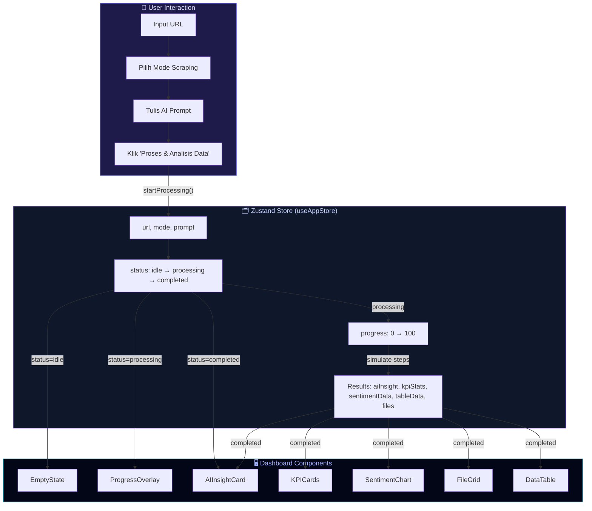
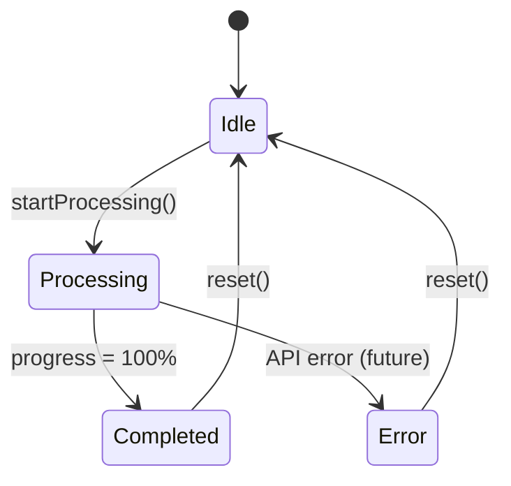
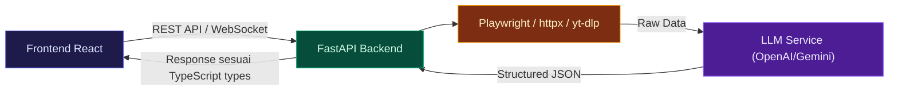

# 📖 Dokumentasi Project: WebIntel AI

> **Smart Web Scraper & Intelligence Agent** — Dashboard UI berbasis AI untuk scraping, analisis sentimen, dan visualisasi data web.

---

## 1. Ringkasan Project

**WebIntel AI** adalah aplikasi dashboard single-page yang dirancang sebagai frontend untuk AI-powered web scraper. Pengguna dapat:

- Memasukkan URL dari berbagai platform (YouTube, Google Maps, Social Media, dll.)
- Memilih mode scraping (Auto Detect, YouTube, Google Maps, Social Media, Document Harvester)
- Menulis perintah natural language untuk AI
- Melihat hasil analisis berupa: AI Insight Summary, KPI Cards, Sentiment Chart, Data Table, dan File Grid
- Berinteraksi dengan AI Assistant melalui Chat Widget floating

> [!IMPORTANT]
> Saat ini project masih menggunakan **mock data** untuk simulasi. Backend (FastAPI) belum diimplementasikan. Spesifikasi backend tersedia di [BACKEND_SPECS.md](file:///c:/Users/M%20S%20I/PentingDah/Project/scarper_web_llm/BACKEND_SPECS.md).

---

## 2. Tech Stack

| Kategori | Teknologi | Versi |
|---|---|---|
| **Build Tool** | Vite | ^8.3.0 |
| **Framework** | React (TypeScript) | ^19.2.8 |
| **Styling** | Tailwind CSS v4 | ^4.3.3 |
| **State Management** | Zustand | ^5.0.15 |
| **Charts** | Recharts | ^3.10.1 |
| **Icons** | Lucide React | ^1.49.0 |
| **Utilities** | clsx + tailwind-merge (CVA pattern) | — |
| **Linter** | Oxlint | ^1.81.0 |
| **Package Manager** | pnpm | — |

---

## 3. Struktur Direktori Project

```text
scarper_web_llm/
├── index.html                  # HTML entry point (dark mode default)
├── package.json                # Dependencies & scripts
├── vite.config.ts              # Vite config + path alias (@/ → src/)
├── tsconfig.json               # TypeScript config root
├── tsconfig.app.json           # TS config untuk aplikasi
├── tsconfig.node.json          # TS config untuk Node/Vite
├── .oxlintrc.json              # Oxlint configuration
├── .gitignore                  # Git ignore rules
├── PROJECT_PLAN.md             # Rencana & target fitur project
├── BACKEND_SPECS.md            # Blueprint untuk backend (FastAPI)
├── README.md                   # Default Vite README
├── public/                     # Static assets (favicon, dll.)
├── dist/                       # Production build output
└── src/                        # 📁 SOURCE CODE UTAMA
    ├── main.tsx                # React DOM entry point
    ├── App.tsx                 # Root component & page layout
    ├── index.css               # Global CSS + Design System tokens
    ├── components/             # 📁 UI Components
    │   ├── layout/
    │   │   └── Header.tsx      # Navigation bar (logo, status, theme toggle)
    │   ├── input/
    │   │   └── CommandBar.tsx  # URL input, mode selector, AI prompt, submit
    │   ├── dashboard/
    │   │   ├── EmptyState.tsx       # Tampilan awal (idle)
    │   │   ├── ProgressOverlay.tsx  # Loading bar 4-step (Fetch→Parse→Analyze→Report)
    │   │   ├── AIInsightCard.tsx    # Ringkasan AI, key findings, rekomendasi
    │   │   ├── KPICards.tsx         # 4 metric cards (Total Data, Sentiment, dll.)
    │   │   ├── SentimentChart.tsx   # Donut/Bar chart sentiment (Recharts)
    │   │   ├── FileGrid.tsx        # Grid file hasil scraping + download
    │   │   └── DataTable.tsx       # Tabel data + search, filter, sort, pagination, export CSV
    │   └── chat/
    │       └── ChatWidget.tsx  # Floating chat assistant
    ├── store/
    │   └── useAppStore.ts      # Zustand global state management
    ├── types/
    │   └── index.ts            # TypeScript interfaces & types
    ├── mock/
    │   └── data.ts             # Mock data untuk simulasi UI
    └── lib/
        └── utils.ts            # Utility function: cn() (clsx + twMerge)
```

---

## 4. Arsitektur & Data Flow

Berikut diagram alur data di dalam aplikasi:



---

## 5. Cara Kerja Aplikasi (Step-by-Step)

### 5.1. State Awal (Idle)

Saat aplikasi pertama kali dibuka:
- `status` = `'idle'` → Menampilkan **EmptyState** (ilustrasi animasi + quick start tips)
- **Header** menampilkan logo, API status (connected), dan theme toggle (dark/light)
- **CommandBar** siap menerima input URL, mode, dan prompt

### 5.2. User Memasukkan Input

1. **URL Input** — Pengguna mengetik URL
   - Fungsi `detectUrlType()` di [CommandBar.tsx](file:///c:/Users/M%20S%20I/PentingDah/Project/scarper_web_llm/src/components/input/CommandBar.tsx#L26-L42) otomatis mendeteksi tipe URL:
     - `youtube.com` → badge "youtube" + icon merah
     - `maps.google.com` → badge "google-maps" + icon hijau
     - `twitter.com`, `instagram.com`, dll. → badge "social-media"
     - `.pdf`, `.doc` → badge "pdf-docs"
     - Lainnya → "general"
   
2. **Mode Selector** — Dropdown untuk memilih strategi scraping:
   - `Auto Detect` (default), `Google Maps`, `YouTube`, `Social Media`, `Document Harvester`

3. **AI Prompt** — Textarea untuk instruksi natural language (contoh: "Saring komentar negatif")

### 5.3. Proses Scraping (Simulasi)

Ketika tombol **"Proses & Analisis Data"** diklik, fungsi [`startProcessing()`](file:///c:/Users/M%20S%20I/PentingDah/Project/scarper_web_llm/src/store/useAppStore.ts#L116-L144) di Zustand store dijalankan:

```
status: idle → processing
progress: 0 → 12 → 25 → 38 → 50 → 62 → 75 → 88 → 95 → 100
(setiap step interval 350ms)
```

**ProgressOverlay** menampilkan:
- Animated spinner + progress bar gradient
- Status text berubah sesuai progress:
  - `< 30%` → "Mengambil konten dari URL..."
  - `< 60%` → "Menjalankan analisis sentimen AI..."
  - `< 90%` → "Menyusun laporan dan visualisasi..."
  - `≥ 90%` → "Finalisasi hasil..."
- 4 step indicators: **Fetch → Parse → Analyze → Report** (✓ jika selesai)

### 5.4. Menampilkan Hasil (Completed)

Setelah progress mencapai 100%, `status` berubah menjadi `'completed'` dan **mock data** di-load ke store:

| Data | Source | Component |
|---|---|---|
| `mockAIInsight` | [mock/data.ts](file:///c:/Users/M%20S%20I/PentingDah/Project/scarper_web_llm/src/mock/data.ts#L3-L14) | **AIInsightCard** — Summary, Key Findings, Recommendation |
| `mockKPIStats` | [mock/data.ts](file:///c:/Users/M%20S%20I/PentingDah/Project/scarper_web_llm/src/mock/data.ts#L16-L45) | **KPICards** — 4 metric cards dengan gradient icons |
| `mockSentimentData` | [mock/data.ts](file:///c:/Users/M%20S%20I/PentingDah/Project/scarper_web_llm/src/mock/data.ts#L47-L51) | **SentimentChart** — Donut/Bar chart (Positive/Negative/Neutral) |
| `mockTableData` | [mock/data.ts](file:///c:/Users/M%20S%20I/PentingDah/Project/scarper_web_llm/src/mock/data.ts#L53-L172) | **DataTable** — 12 rows data dengan search, filter, sort, pagination |
| `mockFiles` | [mock/data.ts](file:///c:/Users/M%20S%20I/PentingDah/Project/scarper_web_llm/src/mock/data.ts#L174-L181) | **FileGrid** — 6 files (PDF, Excel, CSV, Image, Word) |

### 5.5. Interaksi Setelah Hasil

- **DataTable** mendukung:
  - 🔍 Search (filter by title, content, source)
  - 🏷️ Filter sentimen (All / Positive / Negative / Neutral)
  - ↕️ Sort (by title, sentiment, score, date)
  - 📄 Pagination (5 rows per page)
  - 📥 Export CSV

- **SentimentChart** bisa toggle antara **Donut Chart** dan **Bar Chart**

- **ChatWidget** — Floating chat di kanan bawah:
  - Pengguna mengetik pertanyaan
  - AI merespon secara simulated (random dari 3 template response)
  - Auto-scroll ke pesan terbaru

- **Reset** — Tombol reset di Header mengembalikan semua state ke `idle`

---

## 6. Detail Komponen

### 6.1. Layout

| Component | File | Fungsi |
|---|---|---|
| **Header** | [Header.tsx](file:///c:/Users/M%20S%20I/PentingDah/Project/scarper_web_llm/src/components/layout/Header.tsx) | Navbar sticky — Logo WebIntel AI, API status indicator, activity status (Idle/Processing/Completed), tombol Reset, Theme Toggle (dark/light) |

### 6.2. Input

| Component | File | Fungsi |
|---|---|---|
| **CommandBar** | [CommandBar.tsx](file:///c:/Users/M%20S%20I/PentingDah/Project/scarper_web_llm/src/components/input/CommandBar.tsx) | Unified command center — URL input dengan auto-detect icon, Mode dropdown selector, AI prompt textarea, Submit button dengan glow animation |

### 6.3. Dashboard

| Component | File | Fungsi |
|---|---|---|
| **EmptyState** | [EmptyState.tsx](file:///c:/Users/M%20S%20I/PentingDah/Project/scarper_web_llm/src/components/dashboard/EmptyState.tsx) | Landing state — Animated globe illustration, quick start tips (YouTube, Maps, Document) |
| **ProgressOverlay** | [ProgressOverlay.tsx](file:///c:/Users/M%20S%20I/PentingDah/Project/scarper_web_llm/src/components/dashboard/ProgressOverlay.tsx) | Progress bar dengan 4-step indicators, shimmer effect, animated spinner |
| **AIInsightCard** | [AIInsightCard.tsx](file:///c:/Users/M%20S%20I/PentingDah/Project/scarper_web_llm/src/components/dashboard/AIInsightCard.tsx) | Ringkasan AI: summary paragraph, bullet key findings, recommendation box |
| **KPICards** | [KPICards.tsx](file:///c:/Users/M%20S%20I/PentingDah/Project/scarper_web_llm/src/components/dashboard/KPICards.tsx) | 4 metric cards: Total Data, Positive %, Negative %, Processing Time — dengan gradient background orbs dan change indicators |
| **SentimentChart** | [SentimentChart.tsx](file:///c:/Users/M%20S%20I/PentingDah/Project/scarper_web_llm/src/components/dashboard/SentimentChart.tsx) | Recharts visualization — Toggle Donut ↔ Bar chart, custom tooltip, percentage stats row |
| **FileGrid** | [FileGrid.tsx](file:///c:/Users/M%20S%20I/PentingDah/Project/scarper_web_llm/src/components/dashboard/FileGrid.tsx) | Grid extracted files — Type-based icons, download individual/ZIP, hover reveal effects |
| **DataTable** | [DataTable.tsx](file:///c:/Users/M%20S%20I/PentingDah/Project/scarper_web_llm/src/components/dashboard/DataTable.tsx) | Full-featured data table — Search, sentiment filter tabs, column sorting, score progress bars, date formatting (id-ID), pagination, CSV export |

### 6.4. Chat

| Component | File | Fungsi |
|---|---|---|
| **ChatWidget** | [ChatWidget.tsx](file:///c:/Users/M%20S%20I/PentingDah/Project/scarper_web_llm/src/components/chat/ChatWidget.tsx) | Floating chat bubble (kanan bawah) — Expandable panel, welcome message, typing indicator animation, simulated AI responses |

---

## 7. State Management (Zustand)

Seluruh state dikelola di satu store: [`useAppStore.ts`](file:///c:/Users/M%20S%20I/PentingDah/Project/scarper_web_llm/src/store/useAppStore.ts)

### State Groups

| Group | Properties | Deskripsi |
|---|---|---|
| **Theme** | `theme`, `toggleTheme()` | Dark/Light mode toggle |
| **Connection** | `apiConnected` | Status koneksi ke backend API |
| **Input** | `url`, `mode`, `prompt` | User input fields |
| **Processing** | `status`, `progress` | `idle` → `processing` → `completed` → `error` |
| **Results** | `aiInsight`, `kpiStats`, `sentimentData`, `tableData`, `files`, `processedTime` | Hasil scraping & analisis |
| **Chat** | `chatOpen`, `chatMessages`, `addChatMessage()` | State chat widget |
| **Actions** | `startProcessing()`, `reset()` | Flow control actions |

### State Flow Diagram



---

## 8. Design System (CSS)

File [`index.css`](file:///c:/Users/M%20S%20I/PentingDah/Project/scarper_web_llm/src/index.css) mendefinisikan design system lengkap:

### 8.1. Color Tokens

| Token | Hex | Penggunaan |
|---|---|---|
| `brand-500` | `#6366f1` | Primary color (Indigo) — buttons, links, active states |
| `accent-cyan` | `#06b6d4` | Secondary accent — gradient endpoints |
| `accent-emerald` | `#10b981` | Success/Positive — sentiment badges, connected status |
| `accent-rose` | `#f43f5e` | Danger/Negative — sentiment badges, error states |
| `accent-amber` | `#f59e0b` | Warning/Sparkle — processing indicator, sparkle animation |
| `accent-violet` | `#8b5cf6` | Tertiary accent — gradients, chat header |
| `surface-950` | `#010410` | Dark mode background |
| `surface-50` | `#f8fafc` | Light mode background |

### 8.2. Custom CSS Classes

| Class | Efek |
|---|---|
| `.glass-card` | Glassmorphism card — rounded, border, backdrop-blur, semi-transparent |
| `.glass-card-elevated` | Sama seperti glass-card tapi lebih opaque + shadow lebih kuat |
| `.glow-brand` | Box-shadow glow indigo (berbeda intensitas dark/light) |
| `.glow-submit` | Animated rotating gradient border on hover |
| `.progress-gradient` | Gradient animasi untuk progress bar |
| `.shimmer` | Shimmer loading effect |

### 8.3. Custom Animations

| Animation | Class | Efek |
|---|---|---|
| `sparkle` | `.animate-sparkle` | Scale + rotate pulse (1.5s loop) |
| `pulse-ring` | `.animate-pulse-ring` | Expanding ring pulse (status indicator) |
| `shimmer` | `.shimmer` | Horizontal shimmer sweep |
| `fade-in-up` | `.animate-fade-in-up` | Slide up + fade in (0.5s) |
| `fade-in` | `.animate-fade-in` | Simple fade in (0.3s) |
| `float` | `.animate-float` | Gentle vertical float (chat button) |
| `glow-rotate` | — | Rotating gradient background |

---

## 9. TypeScript Interfaces

Semua tipe didefinisikan di [`types/index.ts`](file:///c:/Users/M%20S%20I/PentingDah/Project/scarper_web_llm/src/types/index.ts):

```typescript
// Enums / Union Types
ScrapingMode   = 'auto' | 'google-maps' | 'youtube' | 'social-media' | 'document-harvester'
UrlType        = 'youtube' | 'google-maps' | 'social-media' | 'pdf-docs' | 'general'
SentimentType  = 'positive' | 'negative' | 'neutral'
ProcessingStatus = 'idle' | 'processing' | 'completed' | 'error'

// Data Interfaces
KPIStat        → { label, value, change?, changeType?, icon }
SentimentData  → { name, value, color }
ScrapedRow     → { id, title, source, sentiment, score, date, content, url? }
FileItem       → { id, name, type, size, url }
ChatMessage    → { id, role, content, timestamp }
AIInsight      → { summary, keyFindings[], recommendation }
ScrapingResult → { status, progress, aiInsight, kpiStats, sentimentData, tableData, files, processedTime }
```

---

## 10. Cara Menjalankan Project

### Prerequisites
- Node.js 18+
- pnpm (`npm install -g pnpm`)

### Commands

```bash
# Install dependencies
pnpm install

# Jalankan development server
pnpm dev

# Build untuk production
pnpm build

# Preview production build
pnpm preview

# Run linter
pnpm lint
```

### Path Alias

Vite dikonfigurasi di [`vite.config.ts`](file:///c:/Users/M%20S%20I/PentingDah/Project/scarper_web_llm/vite.config.ts) dengan alias:
- `@/` → `src/` (contoh: `import { useAppStore } from '@/store/useAppStore'`)

---

## 11. Roadmap: Integrasi Backend

Berdasarkan [BACKEND_SPECS.md](file:///c:/Users/M%20S%20I/PentingDah/Project/scarper_web_llm/BACKEND_SPECS.md), langkah selanjutnya untuk menghubungkan frontend ke backend:



### Yang perlu diubah:
1. **Ganti `startProcessing()`** — dari mock data simulation ke actual API call (`fetch`/`axios` ke FastAPI endpoint)
2. **Ganti `addChatMessage()`** — hubungkan ke chat endpoint untuk real AI responses
3. **Tambah error handling** — handle `status: 'error'` dengan proper UI
4. **Implementasi WebSocket** — untuk real-time progress updates dari backend

> [!TIP]
> Semua response schema dari backend sudah didesain agar selaras dengan TypeScript interfaces di `src/types/index.ts`. Tidak perlu mengubah komponen UI, cukup ganti data source dari mock ke API.

---

## 12. Ringkasan Arsitektur

```
┌─────────────────────────────────────────────────────┐
│                    index.html                       │
│                       ↓                             │
│                    main.tsx                          │
│                       ↓                             │
│                    App.tsx ←──── useAppStore (Zustand)│
│                       ↓                             │
│  ┌──────────┬────────────────────┬──────────────┐   │
│  │  Header  │     CommandBar     │  ChatWidget   │   │
│  └──────────┘         ↓         └──────────────┘   │
│              ┌────────────────┐                     │
│              │  EmptyState    │  (status=idle)      │
│              │  ProgressOverlay│  (status=processing)│
│              │  AIInsightCard │                     │
│              │  KPICards      │  (status=completed) │
│              │  SentimentChart│                     │
│              │  FileGrid     │                     │
│              │  DataTable    │                     │
│              └────────────────┘                     │
│                                                     │
│  📦 mock/data.ts ──→ Store ──→ Components           │
│  📐 types/index.ts ──→ Type Safety                  │
│  🎨 index.css ──→ Design System + Animations        │
│  🔧 lib/utils.ts ──→ cn() helper                   │
└─────────────────────────────────────────────────────┘
```
